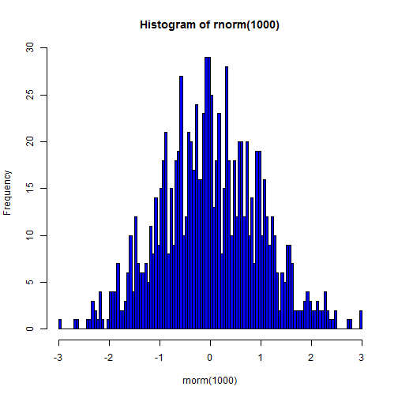

Coursera-Developing Data Products Proj.
========================================================
author: Shayan Jawed
date: 19th September 2014

Introduction
========================================================

This app is created to give an idea about the distributions one can get started with using R.
Following are the main characteristics:
- Upto 1000 random number generation
- Distributions including Normal,Uniform,Log-normal and Exponential.
- Beautiful Plots.

Usability
========================================================

On the left Panel you can choose a distribution and the number of trials to see some basic commands on the right top tabs including Plot.

Fitting Normal Distribution
========================================================

 
Summary of the Data
========================================================

```
   Min. 1st Qu.  Median    Mean 3rd Qu.    Max. 
-2.9700 -0.6580 -0.0225  0.0031  0.6780  2.9700 
```
